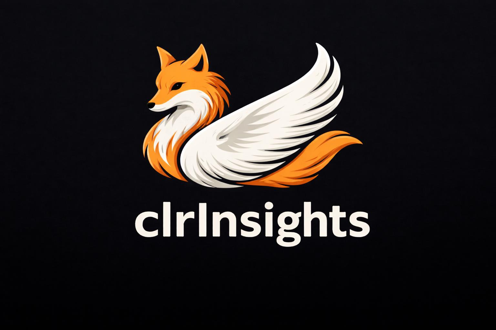
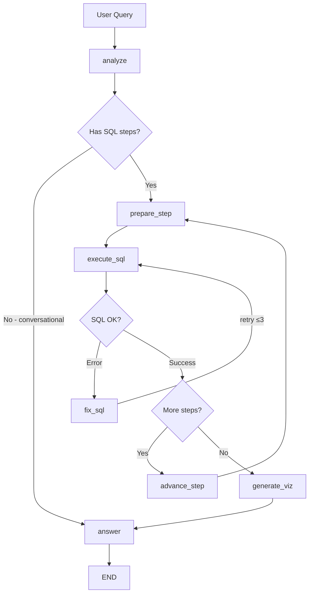

<div align="center">
  
  <p><strong>Conversational Leadership Reports & Insights</strong></p>
  <p>An agentic approach for querying and analyzing UPI transaction data using natural language</p>
</div>

---

## Architecture

CLRInsights uses an agentic approach powered by LangGraph, enabling intelligent data analysis through natural language conversations. The system features:

- **Agentic Workflow**: LangGraph-based agent that plans queries, executes SQL, generates visualizations, and provides insights
- **Dual LLM Support**: Google Gemini (primary) and Groq (fallback) with automatic retry logic
- **Sandboxed Execution**: Safe code execution using RestrictedPython
- **Schema-Driven**: Comprehensive schema file prevents hallucination and ensures accurate queries
- **Conversation Memory**: Full context retention across chat sessions
- **Modern React UI**: Professional chat interface with React + Vite + Tailwind CSS, featuring light/dark mode, real-time execution traces, and responsive design

### Agentic Workflow



## Project Structure

```
clrinsights/
├── frontend/          # React + Vite + Tailwind chat interface
│   ├── src/
│   │   ├── components/    # React components (ChatMessage, InputArea, ExecutionTrace)
│   │   ├── App.jsx        # Main application component
│   │   ├── main.jsx       # React entry point
│   │   └── index.css      # Tailwind CSS styles
│   ├── public/assets/     # Static assets (logo)
│   ├── package.json       # Node.js dependencies
│   ├── vite.config.js     # Vite configuration
│   └── tailwind.config.js # Tailwind CSS configuration
├── agent/             # LangGraph workflow
├── tools/             # SQL, visualization, Python execution tools
├── llm/               # Gemini and Groq clients
├── data/              # DuckDB manager
├── memory/            # Conversation history
├── sandbox/           # Code execution
├── schema.json        # CSV schema definition
├── config.py          # Configuration management
└── main.py            # FastAPI backend
```

## Setup

1. Navigate to clrinsights directory and create virtual environment:
```bash
cd clrinsights
python -m venv .venv
.venv\Scripts\activate  # Windows
# or
source .venv/bin/activate  # Linux/Mac
```

2. Install dependencies:
```bash
pip install -r requirements.txt
```

3. Configure environment:
```bash
copy .env.example .env  # Windows
# or
cp .env.example .env  # Linux/Mac
```

Edit `.env` and configure all settings:
- **API keys** (GEMINI_API_KEY and GROQ_API_KEY) - Required
- **Model names** - All model configurations
- **CSV_PATH** - Path to your CSV file (relative to clrinsights directory)
- **SCHEMA_PATH** - Path to schema.json (default: schema.json)
- All other settings (ports, timeouts, etc.)

## Usage

**Terminal 1 - Start Backend:**

Navigate to `clrinsights` directory and run:

```powershell
# Windows PowerShell
.venv\Scripts\activate
cd ..
uvicorn clrinsights.main:app --host 0.0.0.0 --port 8000 --reload
```

```bash
# Linux/Mac
source .venv/bin/activate
cd ..
uvicorn clrinsights.main:app --host 0.0.0.0 --port 8000 --reload
```

**Terminal 2 - Start Frontend:**

From `clrinsights/frontend` directory:
```bash
npm run dev
```

**Access the application:**
- Backend API: `http://localhost:8000`
- Frontend UI: `http://localhost:3000`


### LLM Models

https://github.com/shoryasethia/clrInsights/blob/601e9cb46db6b2ae0bdf49abf3b05767e8c6a8f9/.env.example#L5-L10

### Data Paths

https://github.com/shoryasethia/clrInsights/blob/601e9cb46db6b2ae0bdf49abf3b05767e8c6a8f9/.env.example#L12-L15

### API Settings

https://github.com/shoryasethia/clrInsights/blob/601e9cb46db6b2ae0bdf49abf3b05767e8c6a8f9/.env.example#L21-L24

### Additional Settings
See `.env.example` for all available configuration options including:
- Sandbox configuration (timeouts, memory limits)
- Memory configuration (conversation history, context window)
- LLM configuration (temperature, retries, timeouts)

## How It Works

1. **User Query**: User asks question in natural language
2. **Query Analysis**: Agent analyzes intent and creates execution plan
3. **SQL Generation**: Agent generates SQL query using schema context
4. **Data Retrieval**: DuckDB executes query on CSV data
5. **Visualization**: If applicable, matplotlib generates charts
6. **Answer Generation**: LLM creates leadership-friendly response
7. **Response**: Answer with optional visualization returned to user

## Schema File

The `schema.json` file is critical for preventing hallucination. It contains:
- Complete column definitions with types and descriptions
- Valid values for categorical columns
- NULL conditions and constraints
- Query guidelines for common patterns

The agent receives this schema context with every query to ensure accurate SQL generation.

## LISCENSE

This project is licensed under the Apache License - see the [LICENSE](LICENSE) file for details.

